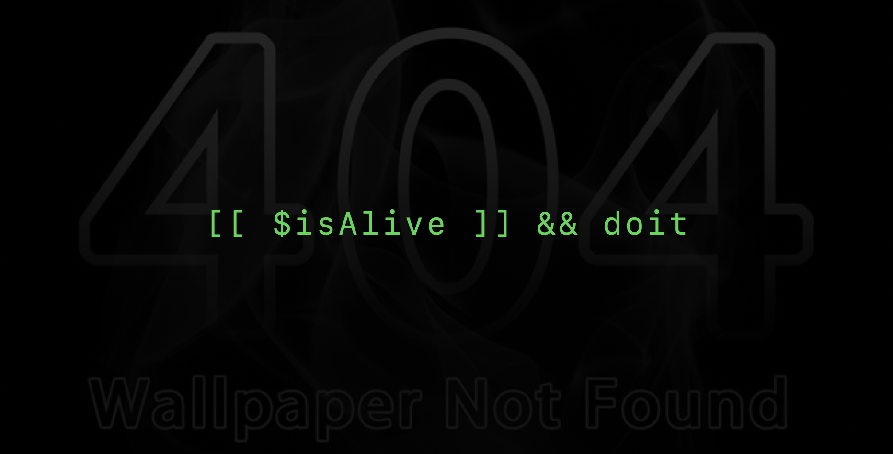

<div align="center">
<p align="center">
  
  
  
</p>
</div>

---

### Stacks & Stats

  <div align="center">
    
    
    
    
    
    
    
    
    
    
    
    
    
    

  <p align="center">
      
    </p>
  </div>

---

Read More:

```Shell
open -a "google chrome" "https://portfolio-black-nine-cfinu410n5.vercel.app/"
```
